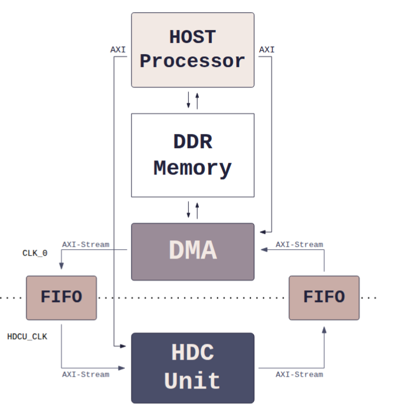

# AXI HDC Accelerator

Hardware Accelerator for Hyperdimensional Computing (HDC) on Xilinx Zynq SoCs, featuring AXI4-Stream/Lite interfaces and a comprehensive C++ driver API.

## Overview

This project provides a complete hardware/software stack for accelerating Hyperdimensional Computing operations on Xilinx FPGA platforms (targeted for Zynq). It includes:
- **HDL Source**: VHDL/SystemVerilog implementation of HDC functional units (Binding, Bundling, Permutation, Similarity, etc.).
- **IP Core**: Packaged AXI4 peripheral ready for Vivado integration.
- **Software Stack**: C++ drivers and higher-level HDC classes for Training and Inference.
- **Automation**: TCL scripts to regenerate Vivado Block Designs (BD).
- **Example Applications**: Full classification flow (Train/Test) using datasets like Iris, ISOLET, etc.

The accelerator offloads computationally intensive HD vector operations from the ARM CPU to the FPGA logic, using SIMD parallelism.

## Features

- **Hardware Accelerated Operators**:
  - `BINDING`: Element-wise XOR.
  - `BUNDLING`: Counter-based bundling.
  - `PERMUTATION`: Cyclic shift permutation.
  - `SIMILARITY`: Hamming distance.
  - `ASSOCIATIVE SEARCH`: Associative memory search.
  - `CLIPPING`: Majority rule.
- **Configurable Architecture**:
  - Parametric SIMD width (4, 8, 16, 32).
  - Configurable HV size (Power of 2).
- **AXI Integration**:
  - **AXI4-Lite**: Control registers and status monitoring.
  - **AXI DMA**: High-speed data transfer (Stream) for vector loading/storing.
- **Scratchpad Memory (SPM)**: Internal multi-bank memory for fast operand access.

## Repository Structure

```
├── automation/          # TCL scripts to regenerate Vivado Block Designs
├── hdl/                 # VHDL source code for the Accelerator
│   ├── Controllers/     # Control logic (AXI, Exception, Pipeline)
│   ├── FUs/             # Functional Units (Binding, Similarity, etc.)
│   └── Packages/        # VHDL Configuration Packages (HDC_PKG.vhd)
├── ip/                  # Packaged IP core for Vivado
├── lib/                 # Software stack (runs on Zynq Application CPU)
│   ├── src/             # Driver implementation (hdc_class.cpp)
│   ├── inc/             # Headers and Configuration (config.hpp)
│   └── example/         # Test applications and Classification demo
├── petalinux/           # Petalinux build artifacts and HW definitions
│   ├── hw/              # Hardware export (.xsa file)
│   └── boot/            # Boot images
└── tb/                  # SystemVerilog Testbench
```

## Prerequisites

### Hardware
- Xilinx Zynq-7000 or Zynq UltraScale+ Board (Design supports Zynq architecture).

### Software
- **Vivado Design Suite**: For hardware synthesis and bitstream generation.
- **Petalinux**: For building the embedded Linux image.
- **ARM GCC Toolchain**: For compiling the C++ application (usually provided by Petalinux SDK).

## Installation & Build

### 1. Hardware (Vivado)

You can regenerate the Block Design using the provided TCL scripts.

1. Open Vivado.
2. In the Tcl Console, source one of the automation scripts depending on your desired SIMD config:
   ```tcl
   source automation/BD_SIMD_16_CB_16_AW_16.tcl
   ```
3. Generate the Bitstream and export Hardware (`.xsa`).

### 2. Embedded System (Petalinux)

*Note: Detailed Petalinux steps are standard and assumed known.*

1. Create a Petalinux project using the exported `.xsa` from `petalinux/hw/` (or your own).
2. Ensure the **Device Tree** reserves memory regions matching `lib/inc/config.hpp` (see [Configuration](#configuration)).
3. Build the boot image (`BOOT.BIN`, `image.ub`).

### 3. Software (Application)

The software runs on the Linux environment on the board.

1. Transfer the `lib/` directory to the board (e.g., via SCP).
2. Compile the examples or the classification app:
   ```bash
   cd lib/
   make
   ```
   *Note: Ensure `g++` on the board is available, or cross-compile from your host.*

To compile the Classification example specifically:
   ```bash
   cd lib/example/Classification
   make
   ```

## Configuration

**CRITICAL**: The Software configuration (`config.hpp`) **MUST** match the Hardware configuration (VHDL generics / `HDC_PKG.vhd`).

### Software (`lib/inc/config.hpp`)
Defines memory maps and HDC parameters.
- **`HV_SIZE_BIT`**: Size of Hypervector (default 1024).
- **`SIMD`**: Parallelism factor (default 16).
- **Memory Map**:
  - `DMA_BASE_ADDR`: `0x40400000`
  - `GPIO_BASE_ADDR`: `0x41200000`
  - `DMA_SRC_BUFFER`: `0x30000000` (Reserved DDR, requires Device Tree entry)

### Hardware (`hdl/Packages/HDC_PKG.vhd`)
Defines VHDL constants.
- `DATA_WIDTH`: 32
- `SIMILARITY_BITS`: 32

## Quickstart / Usage

1. **Boot the Zynq board** with the generated image.
2. **Run a Unit Test** (e.g., Inference Test):
   ```bash
   # On the board
   cd lib/bin
   ./HDC_Inference_Test
   ```
   This will verify:
   - SW/HW Consistency.
   - Inference accuracy.

3. **Run Classification (Iris Dataset)**:
   ```bash
   # 1. Preprocess data (on Host PC or Board if Python avail)
   # (See lib/example/Classification/Dataset/Preprocess_Datasets.ipynb)
   
   # 2. Train Model
   ./classification_app Dataset/iris/train_preprocessed.csv -accl
   
   # 3. Optimize/Inference
   ./inference_app Dataset/iris/test_preprocessed.csv -accl
   ```

## Architecture



The system architecture follows a high-performance coprocessor model designed to offload HDC operations from the Host Processor.

**Data Flow Description**:
1.  **Host Processor (PS)**: Managing the application layer, it configures the hardware via **AXI-Lite** interfaces (register read/write).
2.  **DDR Memory**: Acts as the main storage for large Hypervectors (e.g., 1024-bit to 10k-bit vectors).
3.  **DMA Controller**: Offloads data transfer tasks, moving vectors between DDR and the FPGA fabric via high-speed **AXI-Stream**.
4.  **FIFOs**: Provide elastic buffering between the DMA high-speed stream and the compute core, effectively handling backpressure and potential clock domain crossings between the System Clock (`CLK_0`) and the Accelerator Clock (`HDCU_CLK`).
5.  **HDC Unit (PL)**: The core SIMD engine that consumes the input stream, performs operations (Bind, Bundle, etc.) using internal Scratchpad Memory, and streams results back.

The system follows a coprocessor model:

1.  **Software (CPU)**: Handles dataset parsing, encoding (optional), and orchestration. Configures the HDC Accelerator via AXI-Lite (Memory Mapped).
2.  **DMA**: Transfers large Hypervectors between DDR RAM and the Accelerator's internal Scratchpad Memory (SPM).
3.  **HDC Accelerator**:
    *   **Controller**: Decodes instructions (Bind, Bundle, etc.) from AXI registers.
    *   **SPM**: 4 banks of local memory to store operands.
    *   **Functional Units**: SIMD execution units processing `N` bits per clock cycle.

## Testing

### Simulation
A SystemVerilog testbench is provided in `tb/TB.sv`.
- Load the files in Vivado Simulator.
- Run `tb_HDC_HW_Accelerator`.

### Unit Tests (C++)
Located in `lib/example/`, these test individual operators:
- `HDC_Binding_Test.cpp`
- `HDC_Similarity_Test.cpp`
- `HDC_Search_Test.cpp`
- `HDC_Inference_Test.cpp`
- ...

## Troubleshooting

- **"Open /dev/mem failed"**: Run as `root` (sudo). The driver needs direct hardware access.
- **"Hardware initialization failed"**:
  - Check if the bitstream (PL) is loaded.
  - Verify `HDC_ACCL_BASE_ADDR` in `config.hpp` matches the Address Editor in Vivado.
- **Segmentation Fault**:
  - Often due to memory map mismatches. Ensure the Reserved Memory in Device Tree starts at `0x30000000` and `0x34000000` as defined in `config.hpp`.
  - Check if `HV_SIZE` in software matches the hardware generation.

## License

This project is licensed under the **Apache License 2.0**. See the [LICENSE](LICENSE) file for details.
